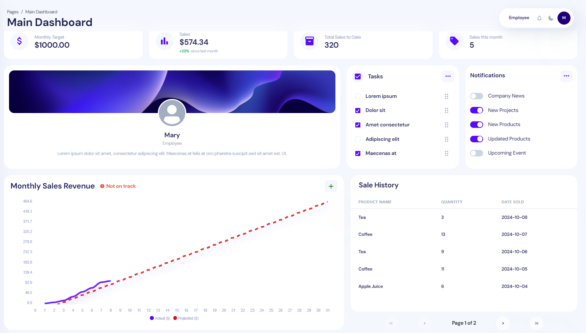
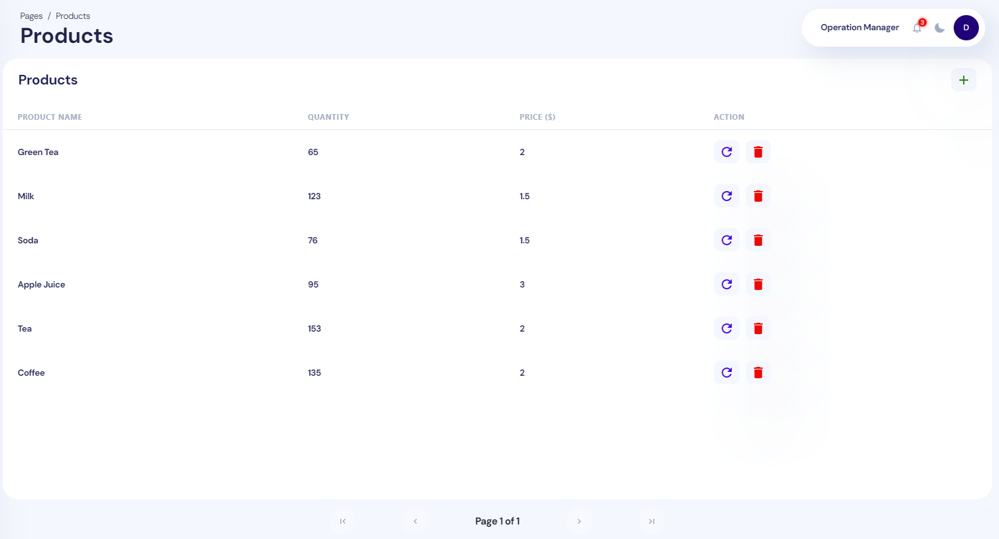
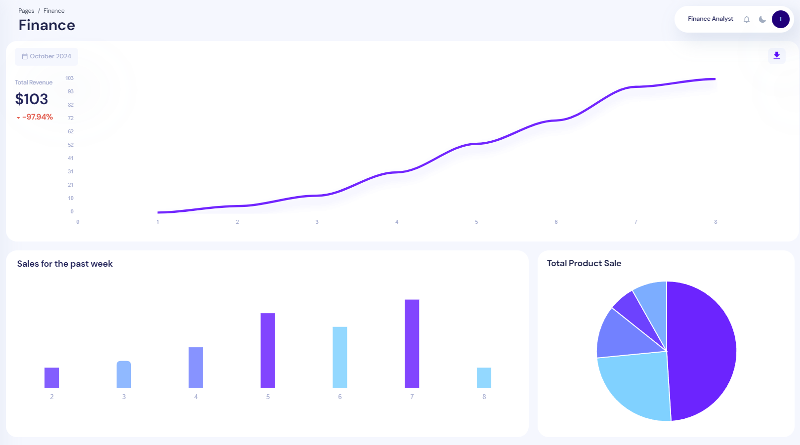
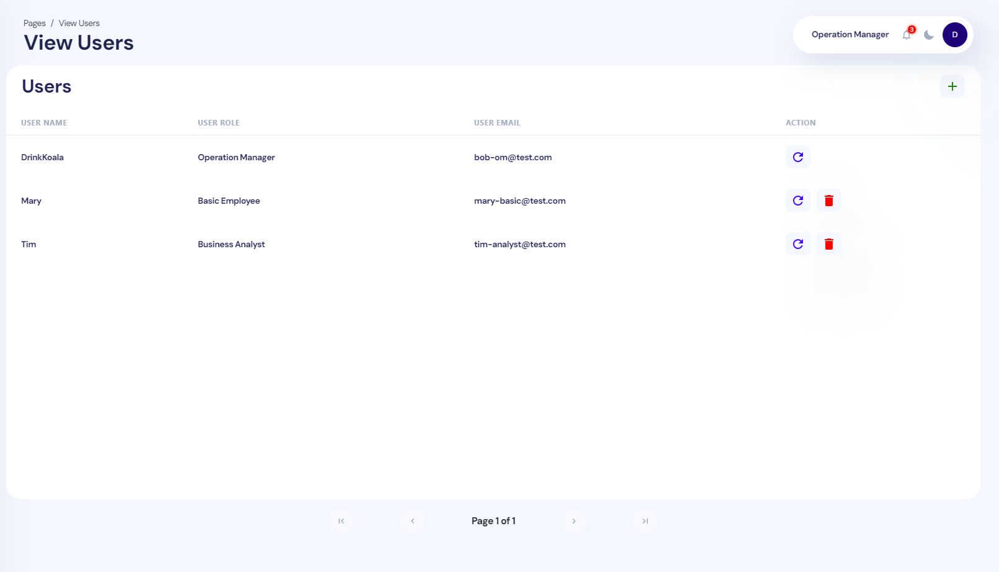
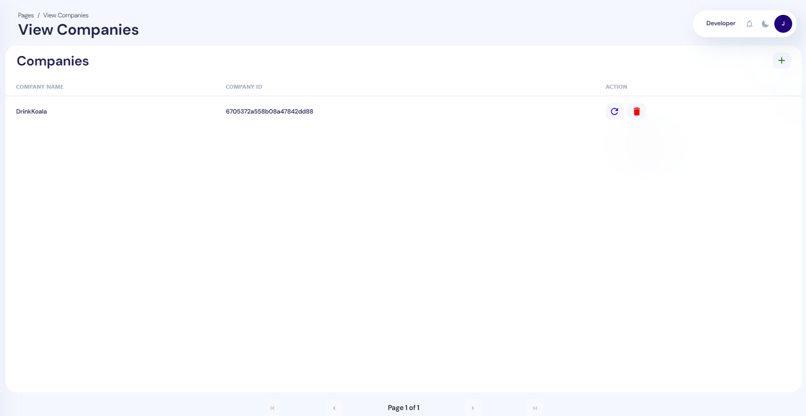
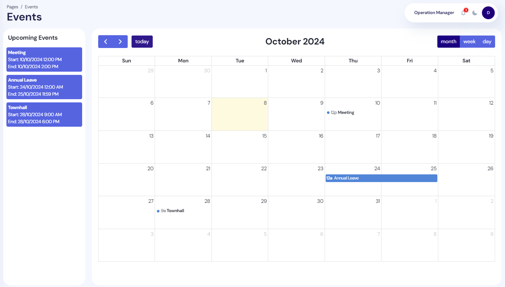
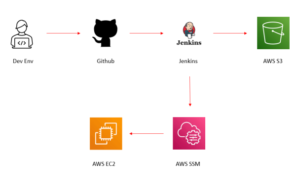

# Bussin Workdash
## Introduction
This project was submitted as partial fulfilment of the requirements for the Graduate Certificate in Architecting Scalable Systems (GCASS) under the NUS-ISS Stackable Certificate Programme in Smart Systems & Platforms.

Bussin Workdash is a Company Management Dashboard (web application) designed to help companies manage sales and inventory.

_Tech Stack: React, Node.js, Express.js, Mongoose, MongoDB, Github, Jenkins, AWS (EC2, S3, SSM)_

## Features
### Main Dashboard

- View sales target and statistics
- View monthly sales revenue (using linear regression for projection)
- View historical sales
- Create Sales 
- Checklist and Notifications Configuration
### Inventory and Sales Management


- CRUD features for Inventory 
- Analytics
### User Management

- CRUD features for Users within a Company
### Company Management

- CRUD features for Companies (Platform Owner only)
### Calendar


## Getting Started
### Installation
1) Install NodeJS LTS from [here](https://nodejs.org/en?ref=horizon-documentation).
2) Run the ```install.bat``` batch file to install all servers. 

### Starting the server
Run the ```start.bat``` batch file to start all servers. (otherwise, run the server's index.js)
Alternatively, use [concurrently](https://github.com/open-cli-tools/concurrently).


## Additional
### CI/CD Pipeline


When a commit is pushed from the local development environment to Github, a webhook it would trigger
a webhook to invoke a Jenkins job to build and test the new code changes. On success, another job will upload
the updated code to AWS S3. On completion, a AWS CLI command will be triggered to run an AWS System Manager 
Command to pull the code from S3 bucket into the instance and restart the server.

